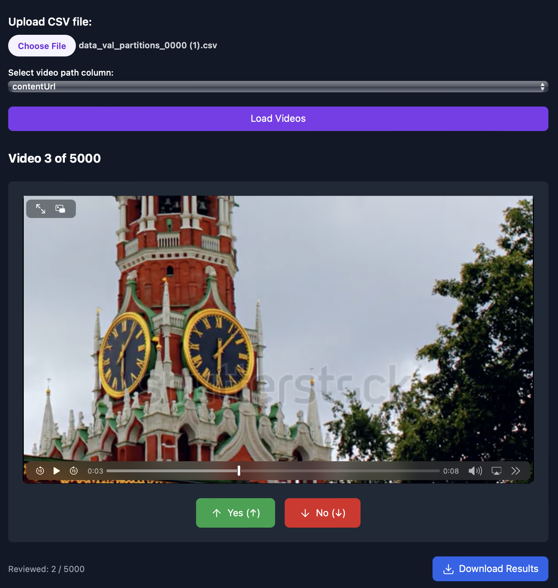

# Quick Manual Video Filtering App




Think of this as a Tinder for your video data. Create a csv file with links to video you want to filter. Click on Up/Down arrow to annotate the video. Takes ~3.5 seconds per video to filter with my speed for 2/5 sec video

To run locally : 

```
npm install
npm run dev
```

You can download the csv file containing your yes/no annotations later.